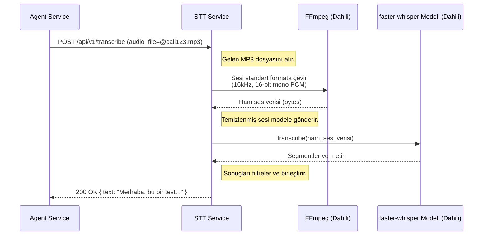
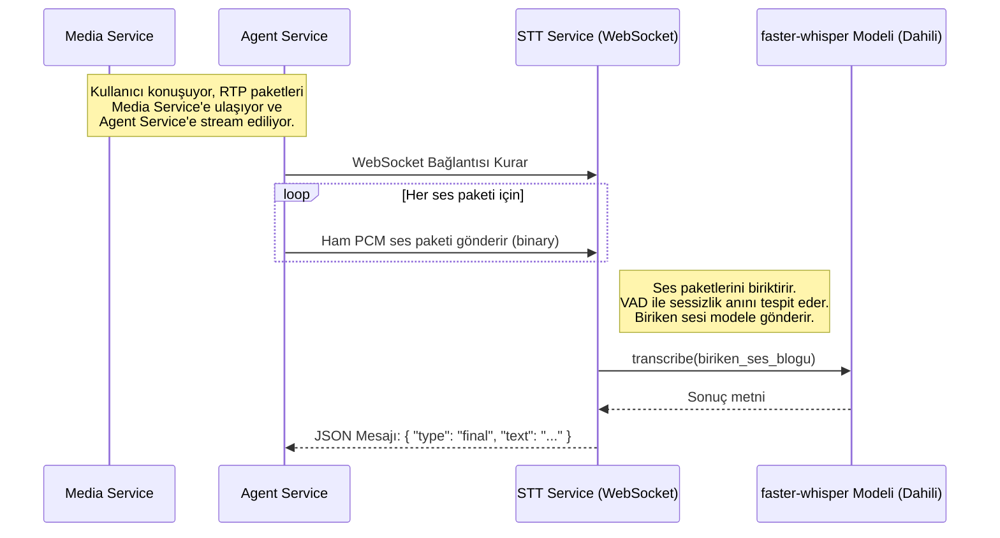

# ⚡ Sentiric STT Service - Mantık ve Akış Mimarisi

**Belge Amacı:** Bu doküman, `stt-service`'in Sentiric platformunun **"evrensel kulakları"** olarak stratejik rolünü, çift modlu çalışma prensibini ve `agent-service` ile `media-service` arasındaki kritik etkileşimini açıklar.

---

## 1. Stratejik Rol: "Evrensel Ses Çözücü"

Bu servisin tek görevi, kendisine herhangi bir formatta gelen ses verisini, platformun anlayabileceği tek bir şeye dönüştürmektir: **metin**. Servis, farklı senaryoların gerektirdiği farklı hız ve format ihtiyaçlarına cevap verebilecek şekilde tasarlanmıştır.

**Bu servis sayesinde platform:**
1.  **Her Şeyi Duyar:** `ffmpeg` entegrasyonu sayesinde, `.mp3`, `.m4a`, `.ogg` gibi onlarca farklı formattaki ses dosyasını işleyebilir. Bu, esneklik sağlar.
2.  **Anlık Konuşmayı Anlar:** Gerçek zamanlı telefon görüşmeleri gibi gecikmenin kritik olduğu senaryolar için optimize edilmiş WebSocket tabanlı bir akış (`streaming`) arayüzü sunar.
3.  **Akıllıca Filtreler:** `faster-whisper` modelinin gelişmiş VAD (Ses Aktivitesi Tespiti) ve olasılık filtrelerini kullanarak, telefon hattındaki gürültüleri veya modelin anlamsız "halüsinasyonlarını" ayıklayarak temiz bir metin çıktısı üretir.
4.  **Teknoloji Bağımsızdır:** Adaptör mimarisi sayesinde, yarın `faster-whisper` yerine `whisper.cpp` veya Google'ın STT servisini kullanmak, sadece bu servisin içinde bir konfigürasyon değişikliği gerektirir.

---

## 2. Uçtan Uca Akışlar

### Senaryo 1: Kayıtlı Bir Ses Dosyasının Metne Çevrilmesi (`/transcribe`)

Bu akış, daha az acil olan, tamamlanmış ses dosyaları içindir.

### Senaryo 2: Gerçek Zamanlı Ses Akışının Metne Çevrilmesi (/transcribe-stream)
Bu akış, canlı telefon görüşmeleri için kritik öneme sahiptir.

